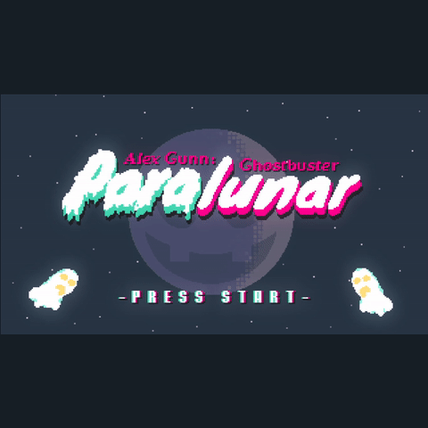
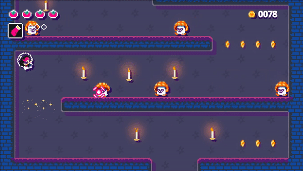
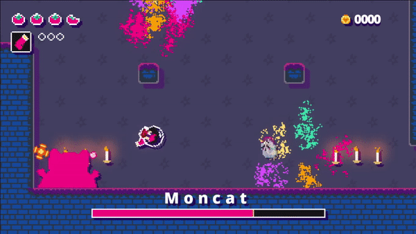
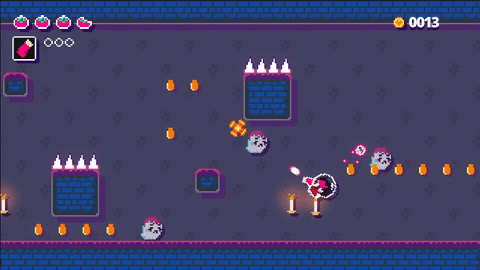
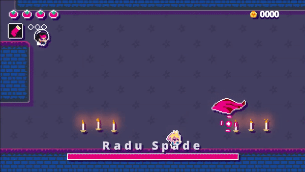

# GitHub Game Off Game Jam Game repository
## 👻 Paralunar 🌙

_**Paralunar**_ is a sequel to [_**Inkorporeal**_](https://github.com/Remruts/Inkorporeal), set on the Moon made in a month for the [GitHub Game Off 2020](https://itch.io/jam/game-off-2020) by Andreas Sturmer with music by Patrick Sturmer. 

The game ended up 2nd place 🥈 overall and 1st place 🥇 in the gameplay category.

You may find the project's page at [remruts.itch.io/paralunar](https://remruts.itch.io/paralunar)

The game was made with [Godot 3.2.3](https://godotengine.org/). 

## Screenshots / GIFs

## License of sorts

- Everything in this repo is provided as is. 

- You may use the game's code, assets, etc. for anything non-commercial. 

- Ask permission if you do decide to use anything here in a commercial product.

- Don't claim the game or any of its assets as your own.
